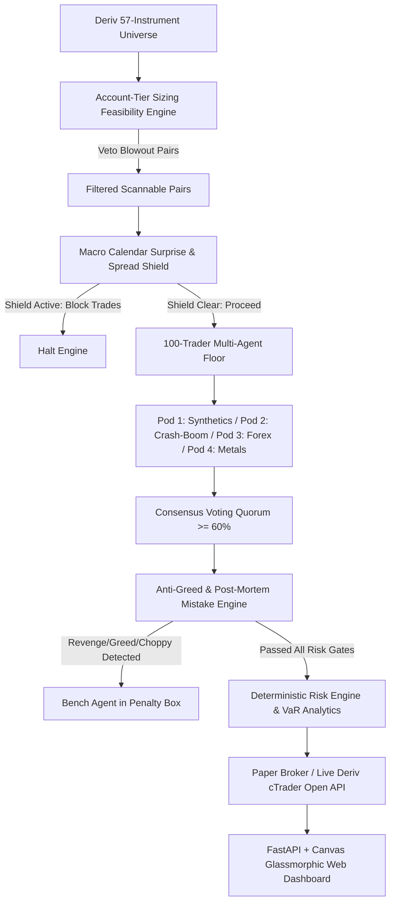

# Antigravity Deriv cTrader Institutional Trading Platform
## Complete User Startup & Operations Manual (`HOW_TO_RUN.md`)

Welcome to the **Antigravity Deriv cTrader Institutional Quantitative Trading Platform**. This software is an institutional-grade, multi-agent algorithmic trading ecosystem engineered specifically for Deriv's full multi-asset catalog (Synthetics, Forex, Metals, Commodities).

---

## Table of Contents
1. [System Overview & Architecture](#1-system-overview--architecture)
2. [Prerequisites & First-Time Installation](#2-prerequisites--first-time-installation)
3. [Quick Start: 1-Click Launchers (Windows)](#3-quick-start-1-click-launchers-windows)
4. [Step-by-Step: Starting the Software](#4-step-by-step-starting-the-software)
   - [Method 1: Visual Web Workstation (Recommended)](#method-1-visual-web-workstation-recommended)
   - [Method 2: Autonomous Live AI Paper Trading Engine](#method-2-autonomous-live-ai-paper-trading-engine)
   - [Method 3: Small Account Safety & Sizing Advisor](#method-3-small-account-safety--sizing-advisor)
5. [Understanding the Visual Web Workstation Interface](#5-understanding-the-visual-web-workstation-interface)
6. [Deriv Small Account Rules ($10–$500 Accounts)](#6-deriv-small-account-rules-10500-accounts)
7. [The Anti-Greed Mistake Engine & Penalty Box](#7-the-anti-greed-mistake-engine--penalty-box)
8. [Complete CLI Command Reference](#8-complete-cli-command-reference)
9. [Switching Between Paper Trading & Live Deriv cTrader](#9-switching-between-paper-trading--live-deriv-ctrader)
10. [Automated Verification & Integrity Tests](#10-automated-verification--integrity-tests)
11. [Troubleshooting & Frequently Asked Questions](#11-troubleshooting--frequently-asked-questions)

---

## 1. System Overview & Architecture

The platform operates on an institutional four-phase quantitative pipeline:



### Core Superpowers:
- **Deriv 57-Instrument Catalog**: Covers Continuous Volatilities (`Vol_10` to `Vol_100`), 1-Second Series (`Vol_10_1s` to `Vol_250_1s`), Crash/Boom (`Crash_300` to `Boom_1000`), Step Indices, Range Break, Jump Indices, Metals (Gold, Silver, Platinum), Oil, and FX Majors.
- **Account-Tier Sizing Feasibility Engine**: Calculates the strict minimum dollar risk ($) per trade based on contract size, tick value, and scalping ATR. Hard-vetoes blowout instruments on micro accounts ($10–$100).
- **100-Trader Multi-Agent Pod Floor**: 100 autonomous specialized agents distributed into 4 pods (Synthetics, Crash/Boom/Step, Forex, Metals) that vote dynamically with Sharpe-weighted capital multipliers.
- **Post-Mortem Mistake Learning & Anti-Greed Engine**: Identifies and blocks human-like trading flaws (`REVENGE_TRADING` within 180s of a loss, `GREED_OVERSIZING` exceeding 2% risk, `CHOPPY_OVERTRADING` with whipsaw > 65%, and `SPIKE_MARGIN_BLOWOUT`). Benches offending agents in a cooling-off Penalty Box and enforces a 15-minute floor-wide tilt cooldown after consecutive drawdowns.
- **Visual Dark Glassmorphic Web Workstation**: High-density institutional terminal featuring live canvas candlestick charts with Fair Value Gaps (FVGs), Point of Control (POC), Liquidity Sweeps, 100-agent matrix lights, and interactive account tier switching.

---

## 2. Prerequisites & First-Time Installation

### System Requirements:
- **Operating System**: Windows 10/11, macOS, or Linux.
- **Python**: Version 3.10, 3.11, 3.12, or 3.13 installed and added to your system `PATH`.
- **Hardware**: Any modern multi-core CPU (4+ cores recommended for running 100 agents), 4GB+ RAM.

### Step-by-Step Installation:

1. **Open PowerShell or Command Prompt (CMD)** and navigate to the project directory:
   ```powershell
   cd c:\Users\lenovo\ctrader
   ```

2. **(Optional but recommended) Create a Virtual Environment**:
   ```powershell
   python -m venv venv
   .\venv\Scripts\Activate.ps1
   ```

3. **Install Dependencies**:
   ```powershell
   pip install -r requirements.txt
   ```
   *(Installs FastAPI, Uvicorn, SQLAlchemy, Rich, Typer, Pydantic, NumPy, Pandas, Scikit-Learn, and Pytest).*

4. **Verify the Configuration File (`.env`)**:
   Ensure `.env` exists in `c:\Users\lenovo\ctrader`. The default template is pre-configured for safe local paper trading:
   ```ini
   TRADING_MODE=paper
   ACCOUNT_BALANCE=10000.0
   MAX_RISK_PER_TRADE=0.02
   DAILY_MAX_DRAWDOWN=0.05
   CTRADER_CLIENT_ID=your_client_id_here
   CTRADER_CLIENT_SECRET=your_client_secret_here
   CTRADER_ACCOUNT_ID=your_account_id_here
   CTRADER_ACCESS_TOKEN=your_access_token_here
   ```

---

## 3. Quick Start: 1-Click Launchers (Windows)

For everyday convenience, two automated batch launchers are located right in the workspace root:

| Launcher File | What It Does | Recommended For |
| :--- | :--- | :--- |
| **`run_dashboard.bat`** | Launches the FastAPI web server on `http://127.0.0.1:8000` and automatically opens your web browser. | **Primary Visual Interface** (Charts, 100 agents, tier switcher, mistake feed). |
| **`run_trading.bat`** | Launches the live automated multi-market paper trading engine in your terminal with colored Rich UI logs. | **Automated Background Trading** (Continuous scanning, agent voting, trade execution). |

Simply **double-click** either `.bat` file in Windows File Explorer!

---

## 4. Step-by-Step: Starting the Software

### Method 1: Visual Web Workstation (Recommended)

1. Open PowerShell or Command Prompt in `c:\Users\lenovo\ctrader`:
   ```powershell
   python main.py dashboard --port 8000
   ```
2. Open your favorite web browser (Chrome, Edge, Brave, Firefox) and navigate to:
   **[http://127.0.0.1:8000](http://127.0.0.1:8000)**
3. The dark glassmorphic institutional terminal will load immediately, polling live data every 1.8 seconds.

---

### Method 2: Autonomous Live AI Paper Trading Engine

To let the 100-trader multi-agent floor autonomously scan the markets, vote on trade setups, enforce risk guardrails, and execute paper positions:

1. In PowerShell or CMD, run:
   ```powershell
   python main.py run --mode paper
   ```
2. **Fixed-Cycle Run (Optional)**: If you only want to test 5 or 10 scan cycles:
   ```powershell
   python main.py run --mode paper --cycles 5
   ```
3. The terminal displays real-time Rich tables showing:
   - Scanned instruments passing account feasibility
   - 100-agent quorum consensus votes (BUY, SELL, or PASS)
   - Anti-Greed pre-trade validation status
   - Active open positions with live profit/loss ($)
   - Total capital saved from intercepted mistakes
4. Press **`CTRL+C`** at any time to gracefully shut down the trading engine.

---

### Method 3: Small Account Safety & Sizing Advisor

If you are trading with a small account ($10, $50, $100, $250, or $500), **run this tool first before taking any trade**:

```powershell
python main.py small-account-advice --balance 50
```

The engine will scan all 57 Deriv instruments, calculate the minimum dollar risk for each pair at the broker's minimum lot size, and output:
- **Approved Safe Pairs**: Instruments where minimum risk is `< 2.0%` of your $50 account (e.g., `Vol_10_1s`, `Step_Index`, `EURUSD`, `USDJPY`).
- **Forbidden Blowout Pairs**: Instruments where 1 standard stop loss risks 10% to 40% of your balance (e.g., `Vol_75`, `Crash_1000`, `XAUUSD`) — **strictly vetoed**.

---

## 5. Understanding the Visual Web Workstation Interface

When you open **`http://127.0.0.1:8000`**, you have access to a complete institutional trading desk:

### 1. Header Bar: Master Controls, Sizing Switcher & Telemetry
- **MASTER START / STOP AUTO-TRADING BUTTON (Center-Left)**:
  - **`[▶ START AUTO-TRADING]`** (Green Glowing): Click to activate autonomous live market scanning, 100-agent quorum voting, and automatic order execution.
  - **`[⏹ STOP AUTO-TRADING]`** (Red/Amber Pulsing): Click at any time to pause the automated engine. (Any existing open positions will continue to be managed to their TP/SL or timeout).
  - **Status Label**: Displays `● ENGINE: STANDBY (STOPPED)` when paused, or `● AUTO-TRADING: ACTIVE (SCANNING & VOTING)` when live.
- **Interactive Tier Switcher**:
  - `[$50 MICRO]`: Filters the dashboard to pairs safe for a $50 account.
  - `[$250 SMALL]`: Unlocks mid-range synthetics like `Vol_50_1s` and `EURGBP`.
  - `[$1,000 MID]`: Unlocks `Vol_75_1s`, `XAUUSD`, and standard volatility indices.
  - `[$10,000 INST]`: Full institutional access across all 57 instruments.
  *(Clicking any button instantly updates the scanner badges, sizing calculations, and active agent pool!)*
- **Live Telemetry**: Real-time Balance, Equity, 2% Risk Cap, 99% VaR, and Anti-Tilt Shield status.
- **Emergency Kill Switch (Top Right)**: Red `KILL SWITCH` button that immediately liquidates all open positions and suspends trading.

### 2. Left Panel: Deriv 57 Market Scanner & Sizing Filter
- **Real-Time Live Price Ticking**: Prices tick and drift live every second with green/red flash indicators (Tick Up / Tick Down).
- **Category Filter Tabs**: `ALL`, `SYNTHETICS`, `FOREX`, `METALS`.
- **Checkbox: "Hide High-Risk Blowouts"**: Instantly hides any instrument that exceeds your account tier risk budget.
- **Market Cards**: Display real-time price, Market Regime (`TRENDING`, `BREAKOUT`, `CHOPPY`), dynamic Win Probability bar, Whipsaw risk index, and safety badges:
  - `✓ SAFE FOR $50` (Green)
  - `⚠ BLOWOUT VETO` (Red)
- **Click any card** to switch the center candlestick chart to that instrument immediately!

### 3. Center Stage: High-Resolution Canvas Chart & Live Positions
- **Candlestick Chart**: Real-time 1-minute price action updated dynamically on every price tick.
- **Fair Value Gaps (FVG)**: Shaded cyan boxes (Bullish FVG) and magenta boxes (Bearish FVG) showing institutional liquidity voids.
- **Point of Control (POC)**: Yellow dashed line marking the highest-volume price level.
- **Liquidity Sweeps**: Visual labels marking sweeps of Asian session and daily highs/lows.
- **Active Scalping Positions Table**:
  - Displays real ticket IDs, Symbols, Sides, Lots, Entry Price, Live Current Price, SL, TP, and tick-by-tick Unrealized PnL ($).
  - **Duration & Timeout Monitor**: Tracks trade age in seconds (**Target: 60s**, **Soft timeout: 90s**, **Hard timeout: 180s**).
  - **Manual [Close] Button**: Lets you manually close any individual position with a single click.

### 4. Right Panel: 100-Trader Multi-Agent Floor
- **4 Specialized Institutional Pods**:
  1. *Synthetics & Jumps Pod* (25 Agents)
  2. *Crash, Boom & Step Pod* (25 Agents)
  3. *Forex Majors & Crosses Pod* (25 Agents)
  4. *Metals & Commodities Pod* (25 Agents)
- **100-Agent Dot Matrix**: Live green nodes for active agents; glowing red nodes for agents currently benched in the **Penalty Box**.
- **Consensus Gauge**: Real-time circular meter measuring floor consensus against the required 60% quorum threshold.

### 5. Bottom Panel: Macro Calendar, AI Dossier & Anti-Greed Mistake Feed
- **Macroeconomic Calendar & Spread Defense Shield (Left)**:
  - **Dynamic Countdown Badges**: Displays real-time countdowns for high-impact events (`in 14m 20s`, `in 53m`, `RELEASED 26m ago`).
  - **Automated Spread Defense Shield**:
    - `SPREAD SHIELD: READY`: Shield is on standby and actively monitoring order book liquidity.
    - `SPREAD SHIELD: ARMED (LOCKDOWN)`: Automatically engages at **T-15 minutes** before any Tier-1 release (CPI, NFP, FOMC). Hard-vetoes automated and broker orders on affected instruments to protect against spread spikes (e.g. 5x-10x wider bid/ask) and slippage.
  - **Dynamic Multi-Asset Impact Mapping**:
    - The AI automatically extracts all affected instruments. For **USD events**, it links **commodities** (`XAUUSD` Gold, `XAGUSD` Silver, `US_OIL` WTI Crude, `UK_OIL` Brent, `XPTUSD` Platinum), **forex pairs** (`EURUSD`, `GBPUSD`, `USDJPY`, `AUDUSD`, `USDCAD`), and **crypto** (`BTCUSD`).
    - Deriv synthetics (`Vol_10_1s`, `Crash_500`, `Step_Index`) are tagged as **news-immune safe havens**.
  - **Interactive AI Macro Intelligence Dossier Modal**:
    - **Click any event card** to pop up the deep institutional analysis dossier!
    - **Primary Sources Investigated**: Displays real-time data ingestion from `BLS.gov`, `Federal Reserve FOMC`, `TradingEconomics`, `ForexFactory`, and `World Gold Council`.
    - **Actionable Step-by-Step Instructions**: Plain-English guidance telling the user whether to close open scalps, stay out of the market, or safely rotate into synthetic indices.
    - **Direct Chart Switch**: Clicking any affected commodity or forex badge in the modal immediately switches the main candlestick chart to that symbol.

- **Post-Mortem Failure Learning & Anti-Greed Log (Right)**:
  - **Live Capital Saved Counter**: Real-time counter of total avoided losses (starts at `$28.50 SAVED` and dynamically increments as rules are enforced).
  - **Interception Audit Log**: Records every blocked `REVENGE_TRADING` attempt (< 180s cooldown), `GREED_OVERSIZING` (> 2% risk limit), `CHOPPY_OVERTRADING` (whipsaw > 65%), and `ACCOUNT_TIER_VIOLATION`.
  - **Interactive `[⚡ TEST SHIELD]` Button**:
    - Click the button in the Anti-Greed header to instantly trigger an on-demand interception simulation.
    - Watch an undisciplined agent get flagged, automatically benched in the **Penalty Box** for 10–15 minutes, and see the **SAVED ($)** counter increase live!

---

## 6. Deriv Small Account Rules ($10–$500 Accounts)

### Why 90% of Retail Traders Blow Small Accounts on Deriv:
On Deriv, contract specifications vary drastically. On **Volatility 75**, 1 index point is worth $1.00 per standard lot. With a minimum lot size of 0.001 and a typical 1-minute stop loss of 12,000 points, **the minimum risk on a single trade is $12.00**. 
- On a $50 account, risking $12.00 is a **24% risk on one trade**. Two consecutive losses destroy 48% of the account.
- The same trap applies to **Crash 1000** ($7.20 min risk) and **Gold (XAUUSD)** ($3.75 min risk).

### Safe vs Forbidden Matrix for $10–$100 Accounts:

| Instrument | Min Lot | Min Dollar Risk ($) | % of $50 Balance | Platform Verdict |
| :--- | :---: | :---: | :---: | :--- |
| **`Vol_10_1s`** | 0.20 | **$0.36** | **0.7%** | **APPROVED (Ultra-Safe)** |
| **`Vol_15_1s`** | 0.10 | **$0.42** | **0.8%** | **APPROVED (Ultra-Safe)** |
| **`Vol_25_1s`** | 0.10 | **$0.57** | **1.1%** | **APPROVED (Safe)** |
| **`Step_Index`**| 0.10 | **$0.60** | **1.2%** | **APPROVED (Predictable)** |
| **`Step_200`**  | 0.10 | **$0.90** | **1.8%** | **APPROVED (Safe)** |
| **`EURUSD`**    | 0.01 | **$0.84** | **1.7%** | **APPROVED (Deep Liquidity)** |
| **`USDJPY`**    | 0.01 | **$0.80** | **1.6%** | **APPROVED (Safe)** |
| **`AUDUSD`**    | 0.01 | **$0.72** | **1.4%** | **APPROVED (Safe)** |
| `Vol_75`        | 0.001| **$9.60–$12.00**| **24.0%** | **HARD VETO (Blowout Risk)** |
| `Vol_100`       | 0.20 | **$5.25** | **10.5%** | **HARD VETO (Blowout Risk)** |
| `Crash_1000`    | 0.20 | **$7.20** | **14.4%** | **HARD VETO (Blowout Risk)** |
| `XAUUSD (Gold)` | 0.01 | **$3.75** | **7.5%**  | **HARD VETO (Blowout Risk)** |

*(High-risk instruments unlock automatically once account equity grows to the Medium or Institutional tiers).*

---

## 7. The Anti-Greed Mistake Engine & Penalty Box

The software implements algorithmic safeguards modeled after elite institutional proprietary trading desks:

| Mistake Type | Trigger Condition | Automated Action | Penalty |
| :--- | :--- | :--- | :--- |
| **`REVENGE_TRADING`** | An agent attempts to re-enter a trade within **180 seconds** of taking a losing trade on the same symbol. | Order is **intercepted & cancelled**. | Offending agent benched for **600 seconds** (10 mins) in the Penalty Box. |
| **`GREED_OVERSIZING`** | Requested trade size risks more than **2.0%** of account equity. | Order size is **clamped to 2% max** or cancelled. | Mistake logged; agent weight reduced. |
| **`CHOPPY_OVERTRADING`** | An agent fires trades in a choppy, sideways regime where the whipsaw risk index exceeds **65%**. | Order is **blocked**. | Agent benched for **300 seconds** (5 mins). |
| **`SPIKE_MARGIN_BLOWOUT`**| Position taken on Crash/Boom opposite to the spike direction without spike margin buffer. | Order is **vetoed**. | Symbol benched for that agent. |
| **`FLOOR-WIDE TILT`** | 3 consecutive losses occur across any pod within a short rolling window. | Entire floor entered into **Anti-Tilt Lockout**. | **15-minute global trading freeze** to allow emotional and market stabilization. |

---

## 8. Complete CLI Command Reference

All commands are run from `c:\Users\lenovo\ctrader`:

| Command | Arguments | Purpose |
| :--- | :--- | :--- |
| `python main.py dashboard` | `--port 8000` | Starts the Visual Web Workstation at `http://127.0.0.1:8000`. |
| `python main.py run` | `--mode paper`<br>`--cycles 10` | Launches the live multi-market scanning and 100-agent paper trading loop. |
| `python main.py small-account-advice` | `--balance 50` | Evaluates all 57 symbols and prints safe pairs vs blowout vetoes for your balance. |
| `python main.py symbols-catalog` | `--category METALS`<br>`--category FOREX` | Displays specifications, contract sizes, tick values, and account tiers for all symbols. |
| `python main.py mistakes-report` | *None* | Prints the post-mortem mistake log, benched agents, and cumulative avoided losses. |
| `python main.py floor-status` | *None* | Shows all 100 agents, active pod allocations, win rates, and capital multipliers. |
| `python main.py macro` | *None* | Displays upcoming economic releases, surprise Z-scores, and spread shield status. |
| `python main.py var-report` | *None* | Displays 99% Portfolio Value-at-Risk, Expected Shortfall (CVaR), and net currency deltas. |
| `python main.py backtest` | `--symbol EURUSD`<br>`--bars 500` | Runs event-driven backtesting with realistic spreads, slippage, and microstructure models. |
| `python main.py train` | `--symbol XAUUSD`<br>`--bars 600` | Trains Random Forest and Gradient Boosting machine learning models on historical features. |
| `python main.py status` | *None* | Summarizes trade journal metrics, closed trade counts, and cumulative realized PnL. |
| `python main.py authorize` | *None* | Generates the official Spotware cTrader OAuth 2.0 URL to connect live accounts. |
| `python main.py emergency-stop` | *None* | **Emergency Kill Switch**: Immediately closes all open positions and cancels orders. |

---

## 9. Switching Between Paper Trading & Live Deriv cTrader

The platform defaults to zero-risk **Paper Trading Mode**. To trade real capital on Deriv cTrader:

1. **Obtain Spotware cTrader Open API Credentials**:
   - Go to [Spotware Open API Portal](https://openapi.ctrader.com/) and register your application.
   - Obtain your `Client ID` and `Client Secret`.
   - Set Redirect URI to `http://localhost:5000/callback` (or your preferred endpoint).

2. **Generate Your Authorization Link**:
   ```powershell
   python main.py authorize
   ```
   Follow the generated URL in your browser, log in with your Deriv cTrader credentials, and copy your `Access Token` and `Account ID`.

3. **Update `.env`**:
   ```ini
   TRADING_MODE=live
   CTRADER_CLIENT_ID=your_actual_client_id
   CTRADER_CLIENT_SECRET=your_actual_client_secret
   CTRADER_ACCOUNT_ID=your_actual_account_id
   CTRADER_ACCESS_TOKEN=your_actual_access_token
   ```

4. **Launch with Real Safeguards**:
   The exact same deterministic Risk Engine, Account Tier Feasibility checks, and Anti-Greed Mistake interceptors will strictly protect your live Deriv capital!

---

## 10. Automated Verification & Integrity Tests

The platform includes an automated unit testing suite validating all mathematical, risk, and algorithmic modules:

```powershell
python -m pytest -v
```

### Verified Test Suites:
- `tests/test_deriv_universe.py`: Validates contract sizes, point values, and tier classifications for all 57 Deriv instruments.
- `tests/test_account_tier.py`: Validates that $50 micro accounts approve `Vol_10_1s` and veto `Vol_75`/`Crash_1000`.
- `tests/test_mistake_engine.py`: Validates revenge trade interception, greed oversizing clamps, choppy whipsaw detection, and agent penalty benching.
- `tests/test_agents_floor.py`: Validates 100-agent initialization across all 4 pods, quorum voting, and consensus thresholds.
- `tests/test_features.py`: Validates calculation of FVGs, Point of Control (POC), order book imbalances, and liquidity sweeps.
- `tests/test_risk_engine.py`: Validates 2% risk sizing caps, 5% daily drawdown limits, and portfolio VaR models.

**Expected Test Result**: `31 passed in ~4.3 seconds` (100% Green).

---

## 11. Troubleshooting & Frequently Asked Questions

### Q: Port 8000 is already in use by another program.
**A**: Launch the dashboard on an alternative port (e.g. 8080 or 9000):
```powershell
python main.py dashboard --port 8080
```
Then open `http://127.0.0.1:8080` in your browser.

### Q: Python says `'uvicorn'` or `'fastapi'` is not recognized.
**A**: Ensure your virtual environment is active, or install dependencies directly into your active Python environment:
```powershell
python -m pip install -r requirements.txt
```

### Q: Why are pairs like Volatility 75 or Crash 1000 showing "BLOWOUT VETO"?
**A**: This is an intentional safety feature! If your account balance is set to $50 or $100, the Risk Engine calculates that trading these pairs violates the 2% maximum risk rule. To preview these pairs, switch the interactive balance in the dashboard top bar to **$1,000** or **$10,000**.

### Q: How do I stop the background server?
**A**: In the terminal running the dashboard or trading engine, press **`CTRL + C`**.

---

*Antigravity Quant Platform &copy; Institutional AI Trading Architecture. Engineered for Deriv cTrader.*
